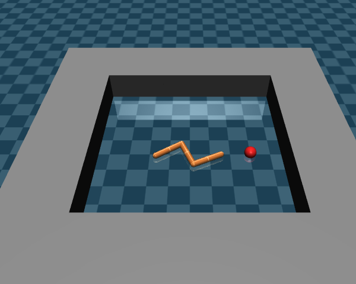
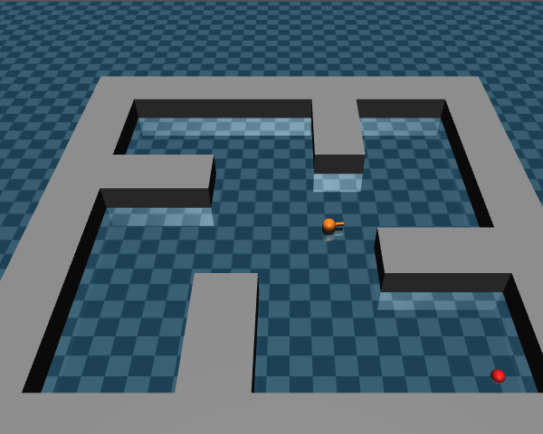
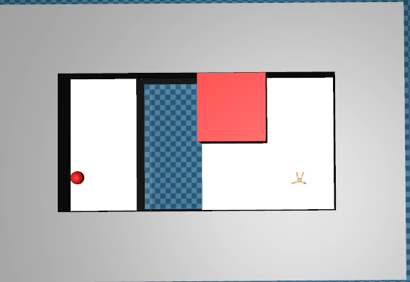
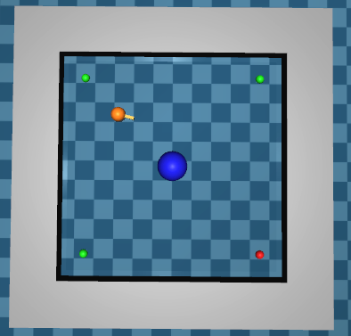

# mujoco-maze
[](https://github.com/kngwyu/mujoco-maze/actions)
[](https://pypi.org/project/mujoco-maze/)
[](https://github.com/psf/black)

Some maze environments for reinforcement learning (RL) based on [mujoco-py]
and [openai gym][gym].

Thankfully, this project is based on the code from  [rllab] and
[tensorflow/models][models].

Note that [d4rl] and [dm_control] have similar maze
environments, and you can also check them.
But, if you want more customizable or minimal one, I recommend this.

## Usage

Importing `mujoco_maze` registers environments and you can load
environments by `gym.make`.
All available environments listed are listed in [Environments] section.

E.g.,:
```python
import gym
import mujoco_maze  # noqa
env = gym.make("Ant4Rooms-v0")
```

## Environments

- PointUMaze/AntUmaze/SwimmerUmaze

  
  - PointUMaze-v0/AntUMaze-v0/SwimmerUMaze-v0 (Distance-based Reward)
  - PointUmaze-v1/AntUMaze-v1/SwimmerUMaze-v (Goal-based Reward i.e., 1.0 or -ε)

- PointSquareRoom/AntSquareRoom/SwimmerSquareRoom

  
  - PointSquareRoom-v0/AntSquareRoom-v0/SwimmerSquareRoom-v0 (Distance-based Reward)
  - PointSquareRoom-v1/AntSquareRoom-v1/SwimmerSquareRoom-v1 (Goal-based Reward)
  - PointSquareRoom-v2/AntSquareRoom-v2/SwimmerSquareRoom-v2 (No Reward)

- Point4Rooms/Ant4Rooms/Swimmer4Rooms

  
  - Point4Rooms-v0/Ant4Rooms-v0/Swimmer4Rooms-v0 (Distance-based Reward)
  - Point4Rooms-v1/Ant4Rooms-v1/Swimmer4Rooms-v1 (Goal-based Reward)
  - Point4Rooms-v2/Ant4Rooms-v2/Swimmer4Rooms-v2 (Multiple Goals (0.5 pt or 1.0 pt))

- PointCorridor/AntCorridor/SwimmerCorridor

  
  - PointCorridor-v0/AntCorridor-v0/SwimmerCorridor-v0 (Distance-based Reward)
  - PointCorridor-v1/AntCorridor-v1/SwimmerCorridor-v1 (Goal-based Reward)
  - PointCorridor-v2/AntCorridor-v2/SwimmerCorridor-v2 (No Reward)

- PointPush/AntPush

  
  - PointPush-v0/AntPush-v0 (Distance-based Reward)
  - PointPush-v1/AntPush-v1 (Goal-based Reward)

- PointFall/AntFall

  
  - PointFall-v0/AntFall-v0 (Distance-based Reward)
  - PointFall-v1/AntFall-v1 (Goal-based Reward)

- PointBilliard

  
  - PointBilliard-v0 (Distance-based Reward)
  - PointBilliard-v1 (Goal-based Reward)
  - PointBilliard-v2 (Multiple Goals (0.5 pt or 1.0 pt))
  - PointBilliard-v3 (Two goals (0.5 pt or 1.0 pt))
  - PointBilliard-v4 (No Reward)

## Customize Environments
You can define your own task by using components in `maze_task.py`,
like:

```python
import gym
import numpy as np
from mujoco_maze.maze_env_utils import MazeCell
from mujoco_maze.maze_task import MazeGoal, MazeTask
from mujoco_maze.point import PointEnv


class GoalRewardEMaze(MazeTask):
    REWARD_THRESHOLD: float = 0.9
    PENALTY: float = -0.0001

    def __init__(self, scale):
        super().__init__(scale)
        self.goals = [MazeGoal(np.array([0.0, 4.0]) * scale)]

    def reward(self, obs):
        return 1.0 if self.termination(obs) else self.PENALTY

    @staticmethod
    def create_maze():
        E, B, R = MazeCell.EMPTY, MazeCell.BLOCK, MazeCell.ROBOT
        return [
            [B, B, B, B, B],
            [B, R, E, E, B],
            [B, B, B, E, B],
            [B, E, E, E, B],
            [B, B, B, E, B],
            [B, E, E, E, B],
            [B, B, B, B, B],
        ]


gym.envs.register(
    id="PointEMaze-v0",
    entry_point="mujoco_maze.maze_env:MazeEnv",
    kwargs=dict(
        model_cls=PointEnv,
        maze_task=GoalRewardEMaze,
        maze_size_scaling=GoalRewardEMaze.MAZE_SIZE_SCALING.point,
        inner_reward_scaling=GoalRewardEMaze.INNER_REWARD_SCALING,
    )
)
```
You can also customize models. See `point.py` or so.

## Warning
Reacher enviroments are not tested.

## [Experimental] Web-based visualizer
By passing a port like `gym.make("PointEMaze-v0", websock_port=7777)`,
one can use a web-based visualizer when calling `env.render()`.


This feature is experimental and can produce some zombie proceses.

## License
This project is licensed under Apache License, Version 2.0
([LICENSE](LICENSE) or http://www.apache.org/licenses/LICENSE-2.0).

[d4rl]: https://github.com/rail-berkeley/d4rl
[dm_control]: https://github.com/deepmind/dm_control
[gym]: https://github.com/openai/gym
[models]: https://github.com/tensorflow/models/tree/master/research/efficient-hrl
[mujoco-py]: https://github.com/openai/mujoco-py
[rllab]: https://github.com/rll/rllab
